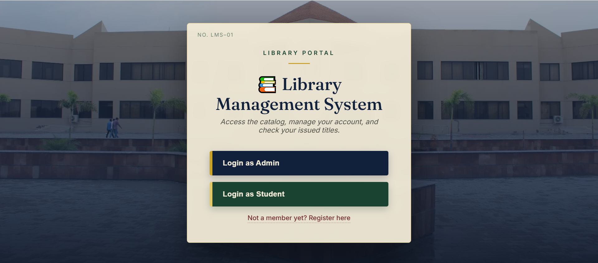
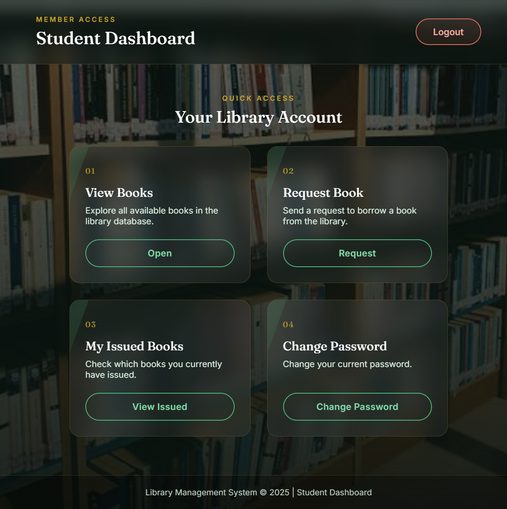
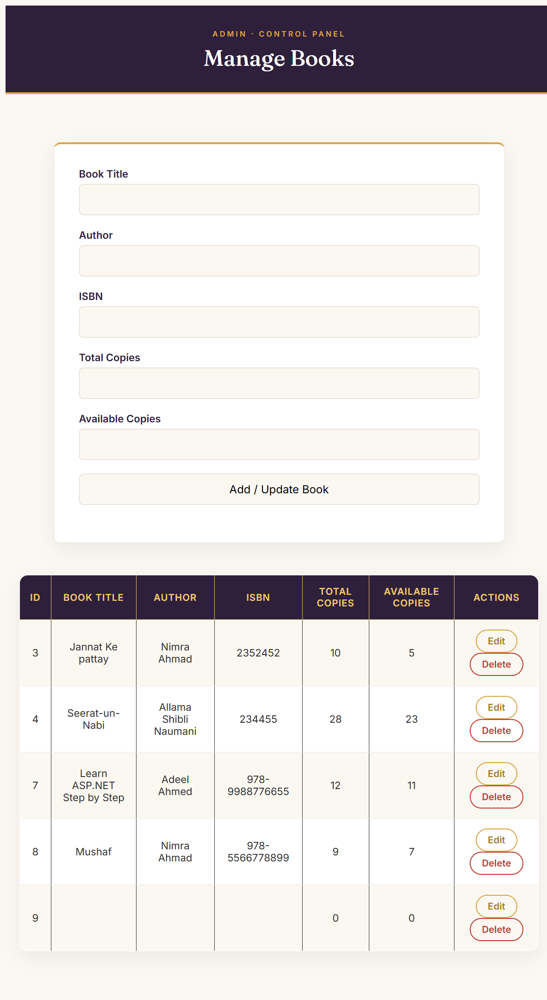
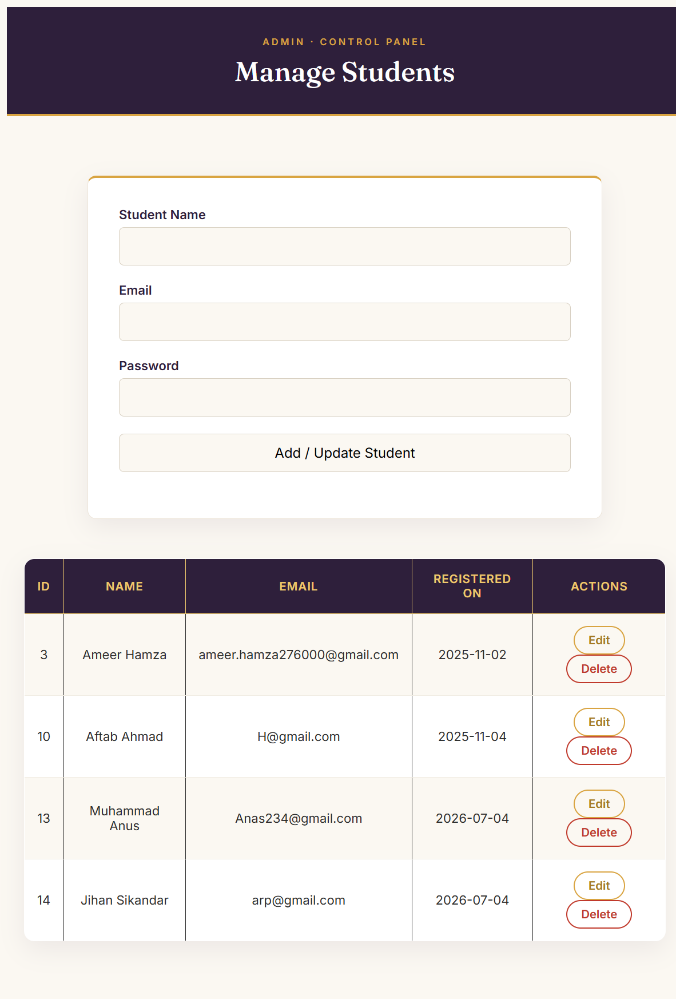
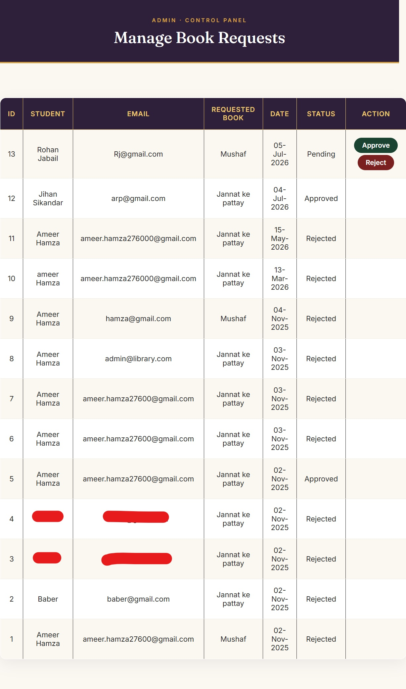

# 📚 Library Management System

A web-based **Library Management System** developed using **ASP.NET Web Forms, C#, and SQL Server**. This application helps librarians efficiently manage books, students, and book issuing/return operations through an easy-to-use administrative interface.

---

## 📖 Project Overview

The Library Management System is designed to automate the day-to-day activities of a library. Instead of maintaining records manually, librarians can manage books, students, and transactions digitally.

This project was developed as part of my learning journey in **ASP.NET Web Forms** and **C#**, focusing on CRUD operations, SQL Server integration, authentication, and database management.

---

## ✨ Features

- 🔐 Admin Login
- 📊 Admin Dashboard
- 👨‍🎓 Student Registration & Management
- 📚 Book Management
- 🔍 Search Books
- 📖 Book Issue
- 📥 Book Return
- 📋 View Issued Books
- 📨 Manage Book Requests
- 🔑 Change Password
- 🗄️ SQL Server Database Integration

---

## 🛠️ Technologies Used

| Technology | Purpose |
|------------|---------|
| ASP.NET Web Forms | Web Application Framework |
| C# | Backend Programming |
| SQL Server | Database |
| HTML5 | Page Structure |
| CSS3 | Styling |
| Bootstrap | Responsive UI |
| JavaScript | Client-side Functionality |
| ADO.NET | Database Connectivity |
| Visual Studio 2022 | Development Environment |

---

## 📂 Project Structure

```
Library Management System
│
├── Admin/
├── Student/
├── Content/
├── Scripts/
├── App_Code/
├── App_Data/
├── Images/
├── Web.config
└── Library Management System.sln
```

---

## 🚀 Getting Started

### Prerequisites

- Visual Studio 2022
- SQL Server
- .NET Framework
- IIS Express (Included with Visual Studio)

### Installation

1. Clone the repository

```bash
git clone https://github.com/ameerhamza522040/Library-Management-System.git
```

2. Open the solution in Visual Studio.

3. Restore the database in SQL Server.

4. Update the SQL Server connection string in `Web.config`.

5. Run the project using IIS Express.

---

## 📸 Screenshots

### Login Page


### Dashboard
.png)
.png)


### Manage Books


### Manage Students


### Manage Requests


## 📚 Learning Outcomes

Through this project, I learned:

- ASP.NET Web Forms
- C# Programming
- CRUD Operations
- SQL Server Integration
- ADO.NET
- Authentication
- Form Validation
- Database Design
- Debugging
- Git & GitHub Basics

---
## Important Note
Database is not included in this repository. Please create the database and update the connection string in Web.config before running the project.

## 🔮 Future Improvements

- Role-based authentication
- Fine calculation automation
- Email notifications
- Report generation
- Barcode/QR code support
- Improved responsive UI
- Dashboard analytics

---

## 👨‍💻 Developer

**Ameer Hamza**

Software Engineering Student

University of Gujrat

GitHub: https://github.com/ameerhamza522040

---

## ⭐ Support

If you found this project helpful, consider giving it a ⭐ on GitHub.

It motivates me to continue learning and building more projects.
